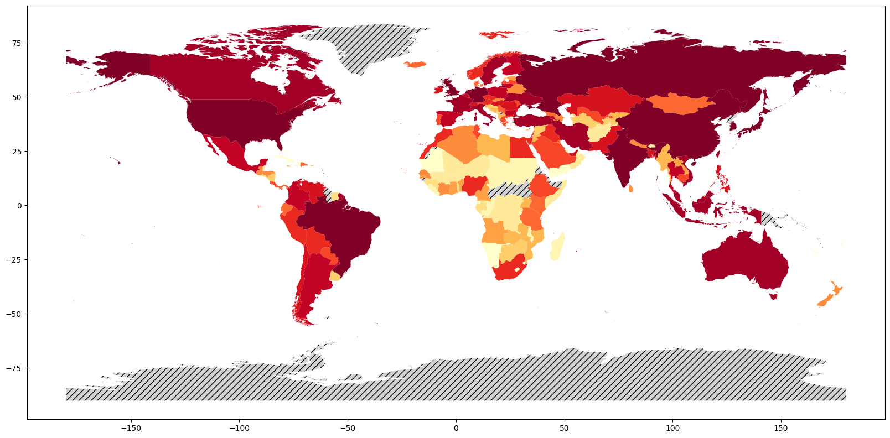

# IP Abuse Score Example

> **DISCLAIMER**: This is just a exploration project on how assigning an Abuse Score to IPs and IP Ranges could work based on public data.

This is a repo where Public Threat Intelligence Feeds are used to calculate IP Abuse Scores by pulling a formula out of thin air.

## Requirements

- [Jupyter Notebook with Python Kernel](https://jupyter.org/): I just use the corresponding and automatically suggested VS Code extensions.
- [IPInfo Free](https://ipinfo.io/products/free-ip-database): Sign-up at IPInfo with the free tier and get your token and put it into the `.env `file.

## Usage

1. Copy `.env.sample` to `.env` and edit the IPInfo Api Key.
2. Open the notebook [`./main.ipynb`](./main.ipynb) and click "Run All".

## Structure

All datasets will be downloaded into the [`./data`](./data) directory.

## Datasets

- [greensnow.co](https://blocklist.greensnow.co/greensnow.txt)
- [abuseipdb.com](https://github.com/borestad/blocklist-abuseipdb)
- [blocklist.de](https://www.blocklist.de/downloads/export-ips_all.txt)
- [cinsscore.com](http://cinsscore.com/list/ci-badguys.txt)
- [stamparm/ipsum](https://github.com/stamparm/ipsum)
- [emergingthreats.net](https://opendbl.net/lists/etknown.list): Excluded due to small size
- [talosintelligence.com](https://opendbl.net/lists/talos.list): Excluded due to small size

## License

